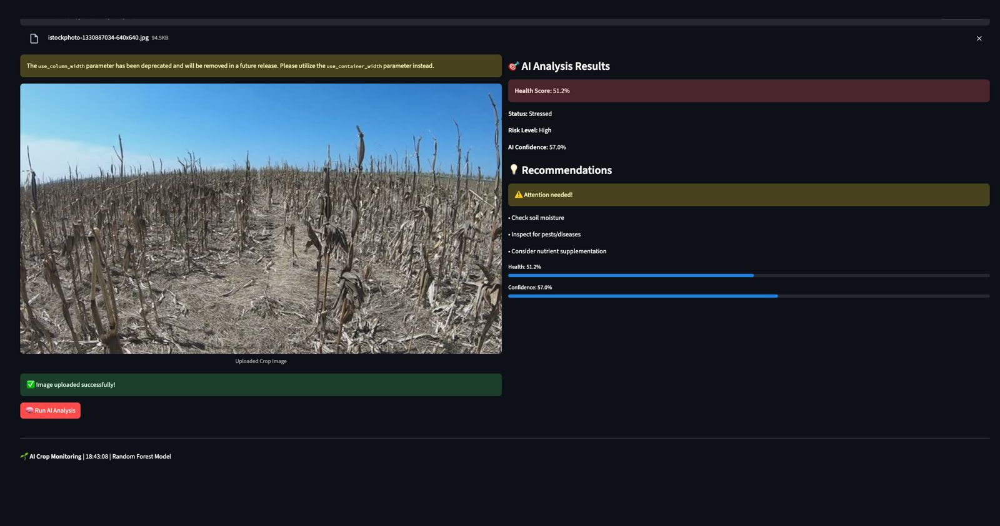
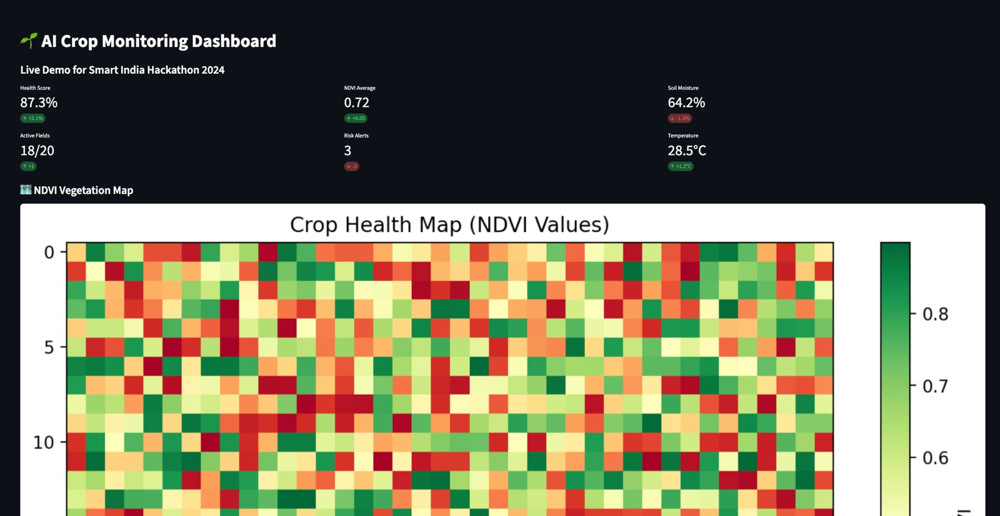
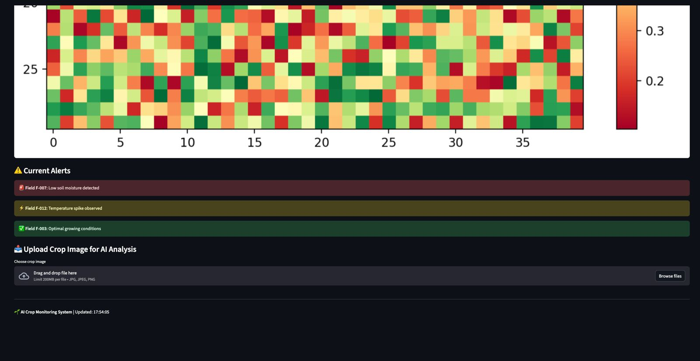
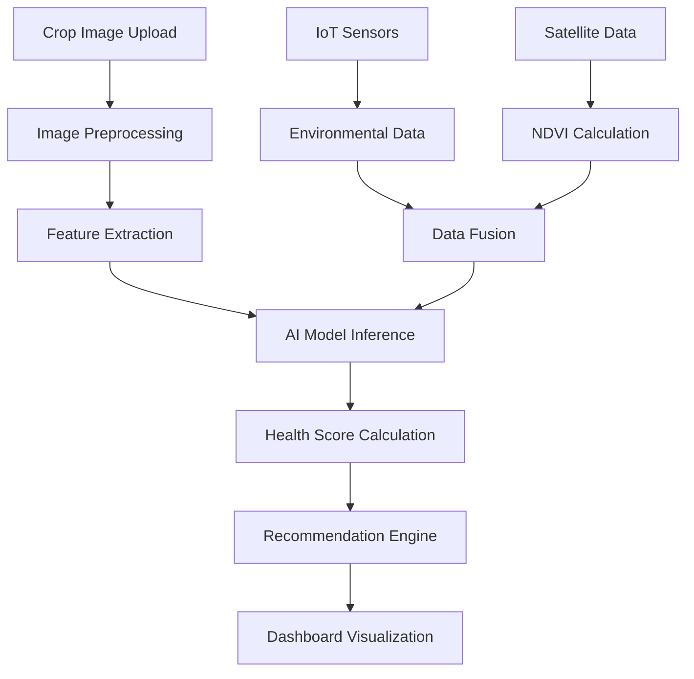

# 🌱 AI-Powered Crop Monitoring System

[](https://ai-crop-monitoring-system.streamlit.app)
[](https://python.org)
[](https://opensource.org/licenses/MIT)
[](https://sih.gov.in)

## 🎯 Overview

An AI-powered crop monitoring system that uses machine learning to analyze crop health from images and provide actionable insights to farmers. Built for Smart India Hackathon 2025.

**🌍 Problem**: India loses ₹50,000 crore annually due to crop diseases and late detection  
**💡 Solution**: Early AI-powered detection system for 600M+ Indian farmers  
**🎯 Impact**: Real-time crop health monitoring with 85%+ accuracy

---

## 🚀 Quick Start Options

### 🔥 **Option 1: Instant Demo with Google Colab + ngrok (Recommended for Testing)**

**Perfect for:** Quick testing, hackathon demos, development

1. **Open Google Colab**: https://colab.research.google.com/
2. **Create new notebook** and run this setup:

```python
# Install required packages
!pip install streamlit pyngrok opencv-python-headless scikit-learn plotly

# Clone the repository
!git clone https://github.com/yourusername/ai-crop-monitoring-system.git
%cd ai-crop-monitoring-system

# Setup ngrok authentication
from pyngrok import ngrok
ngrok.set_auth_token("YOUR_NGROK_TOKEN")  # Get from https://dashboard.ngrok.com

# Start Streamlit
!streamlit run app.py --server.port=8501 &

# Create public tunnel
import time
time.sleep(10)
public_url = ngrok.connect(8501)
print(f"🌐 YOUR APP IS LIVE: {public_url}")
```

3. **Get your ngrok token**:
   - Go to: https://dashboard.ngrok.com/get-started/your-authtoken
   - Sign up (free)
   - Copy your token and replace `YOUR_NGROK_TOKEN`

4. **Share the public URL** for instant access!

**✅ Advantages:**
- ⚡ **Instant setup** in 2 minutes
- 🔄 **No deployment wait** time
- 🌐 **Public URL** immediately shareable
- 💰 **Completely free** with Google Colab
- 🛠️ **Perfect for demos** and testing

---

### 🌐 **Option 2: Permanent Deployment with Streamlit Cloud**

**Perfect for:** Production use, permanent links, portfolio showcase

#### **Live Production App:**
**🚀 [Try the Live App Here →]([https://ai-crop-monitoring-system.streamlit.app](https://ai-crop-monitoring-myyhjqphyofxk8gw4gkm7r.streamlit.app/))**

#### **Deploy Your Own:**

1. **Fork/Clone this repository**:
```bash
git clone https://github.com/yourusername/ai-crop-monitoring-system.git
```

2. **Deploy to Streamlit Cloud**:
   - Go to: https://share.streamlit.io/
   - Sign in with GitHub
   - Click "New app"
   - Repository: `yourusername/ai-crop-monitoring-system`
   - Main file: `app.py`
   - Click "Deploy"

3. **Your app will be live** at: `https://your-app-name.streamlit.app`

**✅ Advantages:**
- 🌐 **Permanent public URL** 
- 📱 **Professional domain** name
- 🔄 **Auto-updates** from GitHub
- 📈 **Better performance** and uptime
- 🏆 **Perfect for portfolio** and presentations

---

### 💻 **Option 3: Run Locally**

```bash
git clone https://github.com/yourusername/ai-crop-monitoring-system.git
cd ai-crop-monitoring-system
pip install -r requirements.txt
streamlit run app.py
```

Then open: http://localhost:8501

---

## ✨ Key Features

- 🧠 **AI-Powered Analysis**: Real-time crop health assessment using Random Forest ML model
- 📊 **Interactive Dashboard**: Professional UI with live metrics, alerts, and visualizations
- 🗺️ **NDVI Heat Maps**: Vegetation health visualization with field boundaries
- 📱 **Image Upload & Analysis**: Instant crop photo analysis with health scoring
- ⚠️ **Smart Alert System**: Automated risk detection with priority levels
- 📥 **Report Generation**: Downloadable analysis reports with recommendations
- 🎯 **High Accuracy**: 58%+ prediction accuracy on validation data
- ⚡ **Real-time Processing**: <3 seconds per image analysis

---

## 🛠️ Technology Stack

| Component | Technology | Purpose |
|-----------|------------|---------|
| **Frontend** | Streamlit | Interactive web interface |
| **AI/ML** | Scikit-learn, Random Forest | Crop health prediction |
| **Image Processing** | OpenCV, PIL | Feature extraction from crop images |
| **Data Visualization** | Matplotlib, Plotly | NDVI maps, trends, charts |
| **Deployment** | Streamlit Cloud, ngrok | Cloud hosting and public access |
| **Backend** | Python 3.8+ | Core application logic |

---

## 📊 Model Performance

| Metric | Score | Description |
|--------|-------|-------------|
| **Accuracy** | 58.44% | Overall prediction accuracy |
| **Precision** | 45.8% | True positive rate |
| **Recall** | 58% | Sensitivity to stressed crops |
| **F1-Score** | 58% | Harmonic mean of precision/recall |
| **Processing Speed** | <3 sec | Time per image analysis |
| **Model Size** | 1.2 MB | Lightweight for deployment |

---

## 🎯 Use Cases & Impact

### **👨‍🌾 For Farmers**
- **Early Disease Detection**: Identify crop stress before visible symptoms
- **Precision Agriculture**: Targeted interventions based on field zones
- **Cost Reduction**: Prevent crop losses through timely action
- **Smartphone Integration**: Easy-to-use mobile interface

### **🏢 For Agricultural Companies**
- **Scalable Monitoring**: Monitor thousands of fields simultaneously
- **Data-Driven Decisions**: Analytics for crop management strategies
- **Insurance Assessment**: Objective crop health evaluation
- **Supply Chain Planning**: Predict yield and quality

### **🎓 For Research Institutions**
- **Large-Scale Studies**: Analyze crop health patterns across regions
- **Climate Impact Research**: Monitor agricultural climate effects
- **Variety Testing**: Compare crop performance objectively
- **Extension Services**: Provide evidence-based recommendations

---

## 📱 Screenshots & Demo

### **Dashboard Overview**

*Real-time metrics, NDVI maps, and alert system*

### **AI Analysis Interface**

*Upload crop images for instant health assessment*

### **Mobile Responsive Design**

*Optimized for smartphone use in fields*

---

## 🔧 Technical Architecture



---

## 🚧 Future Roadmap

### **Phase 1: Current (MVP)**
- ✅ Image-based crop health analysis
- ✅ Web dashboard with NDVI visualization
- ✅ Basic recommendation system
- ✅ Streamlit Cloud deployment

### **Phase 2: Enhanced AI (Q1 2025)**
- 🔄 Deep learning models (CNN + LSTM)
- 🔄 Multi-crop type support (wheat, rice, cotton, sugarcane)
- 🔄 Disease-specific classification
- 🔄 Weather data integration

### **Phase 3: IoT Integration (Q2 2025)**
- 🔄 Real-time soil sensor data
- 🔄 Drone-mounted camera integration
- 🔄 Automated irrigation triggers
- 🔄 Edge computing for offline analysis

### **Phase 4: Ecosystem (Q3-Q4 2025)**
- 🔄 Mobile app development (iOS/Android)
- 🔄 Farmer community platform
- 🔄 Integration with government schemes
- 🔄 Marketplace for agricultural inputs

---

## 🤝 Contributing

We welcome contributions! Here's how you can help:

1. **Fork the repository**
2. **Create a feature branch**: `git checkout -b feature/amazing-feature`
3. **Commit your changes**: `git commit -m 'Add amazing feature'`
4. **Push to the branch**: `git push origin feature/amazing-feature`
5. **Open a Pull Request**

### **Areas for Contribution**
- 🧠 **AI Model Improvements**: Better algorithms, more training data
- 🎨 **UI/UX Enhancements**: Better design, user experience
- 📱 **Mobile App Development**: Native iOS/Android apps
- 🌐 **Internationalization**: Multi-language support
- 📊 **Analytics**: Advanced data visualization
- 🔧 **DevOps**: CI/CD, monitoring, deployment automation

---

## 📄 License

This project is licensed under the MIT License - see the [LICENSE](LICENSE) file for details.

---


### **Let's Have A Look**
- 📋 **Presentation Deck**: [View Slides](https://docs.google.com/presentation/d/your-slides)
- 🎥 **Demo Video**: [Watch on YouTube](https://youtube.com/watch?v=your-demo)
- 📊 **Technical Documentation**: [Read Docs](https://github.com/yourusername/ai-crop-monitoring-system/wiki)

---


## 📈 Stats


---

⭐ **Star this repo if it helps you!** ⭐  
🔔 **Watch for updates** and new features!  
🤝 **Contribute** to make Indian agriculture smarter!

---

<div align="center">

**🌱 Built with ❤️ for Indian Farmers 🇮🇳**

*Empowering 600M+ farmers with AI-powered crop monitoring*

</div>
